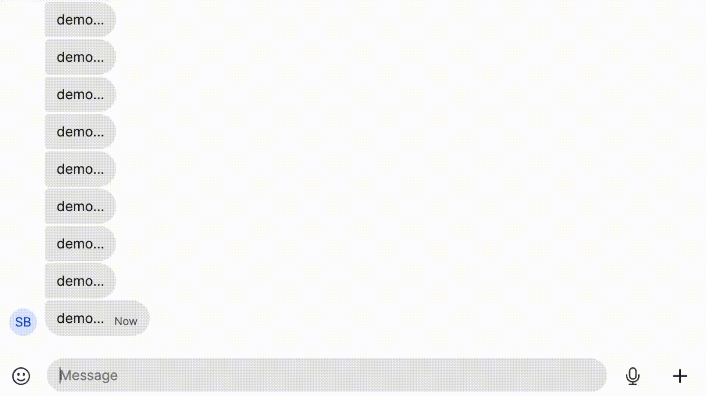

Signal Bot
=========

> A general-purpose chatbot for Signal



This bot is **not** intended for malicious purposes. Its intention is to invoke
some fun in a friendly groupchat.

The bot listens for commands prefixed by some string, and then performs some
action. Actions can be anything the mind wants, ex. print some string, search
the bot's database, or (with the correct permissions) auto-respond with some
message to a target user.

## Philosophy

The bot should be long-running, therefore memory safety and
error-recoverability is of the utmost importance. We therefore wrote the bot in
Zig for its memory control and error ergonomics.

We want to minimize the bot's downtime, which means not having to recompile the
bot or restart due to simple configuration changes. This means that the bot
stores almost no state, and instead relies on external state for configuration.

We have two places to configure the bot (check the usage for instructions
on how to supply these configurations):
- One json file: This stores presumably static configs, such as target group,
  command prefix and which http-ports to listen/send to. Here we also store the
  trust-level required to perform certain actions.
- `sqlite` database: This stores much more frequently changed data, such as a
  `Users` table which maps from user to display-name and trust-level. We also
  store a `Commands` table, which stores all available commands, such as
  `still` in the demo video.

The dual-config approach ensures low downtime, while keeping high maintainability.

The downside to this approach is that currently most configuration changes have
to be applied through the `sqlite` program. We intend to change this to allow
private-dms to the bot to act as a sort of configuration. This way admins can
simply send messages from wherever to the bot, which allows for easy
bot-configuration on the go.

## Usage

Requirements:
- Zig 0.15
- `signal-cli`
- sqlite3
- A phone-number/signal account to act as a bot

Personally, I download the packages using the provided Nix-flake, but should be
available through most package managers.

For the rest of the usage instructions, we assume that you have authenticated
the `signal-cli` instance with the signal account you want to act as a bot.

We spin up the `signal-cli` http-server via:
```console
$ signal-cli daemon --http
```

Then build and run the bot binary:
```console
$ zig build && ./zig-out/bin/signal-bot config.json bot.db
```

`config.json` is the path for the config file. It has to contain certain fields,
thus an example exists in `examples/config.json`.

`bot.db` is simply the path to the bot's database. Don't worry, the bot sets up the
schema for you.

You will manually have to provide the bot with commands and users through the
`sqlite3` program, ex:

```console
$ sqlite3
sqlite> INSERT INTO COMMANDS VALUES("still", 'echo("Still using ", __fir__, " in 2026...")')
```

The above code is what we used to define the `!still` command in the demo
video.

## Implementation

Lets walk through an example command, for example `!still "Rust"`.

1. A user sends the message `!still "Rust"` in the chat.
2. The bot listens to an HTTP-port for signal messages (provided by
   signal-cli), and recieves a json-packet describing the message.
3. The bot decodes the json-packet, maps the message to a specific user via the
   database's `Users` table.
4. The bot checks if the current user has the correct permissions for the
   message (ex. `!eval` requires admin permissions).
5. The bot then maps the first part of the message to a command, and maps the
   rest of the message to command arguments. In this case it finds the `still`
   command in the `Commands` table, and assigns the `__fir__` variable to
   `"Rust"`.
6. The bot executes the script mapped to `still`, which in this case simply
   writes to the chat `Still using "Rust" in 2026...`.

The bot uses a custom, minimal scripting language for the commands's
implementation. This way the bot can control that even with admin permissions,
no malicious commands can be executed.

The scripting language is super simple, and its syntax is very `pythonish`.

## Roadmap

### DM-Configuration

As mentioned above, to improve admin-ergonomics we could allow the bot to also
listen to some specific private-dms, and perform `db`-configuration actions on
those. This would allow for `on-the-go` configuration, where an admin simply
has to send a message from their phone to the bot to configure something.

### Hooks

Currently, the bot is sortof lackluster. The bot simply responds and performs
actions when invoked. We want to implement a `hook` feature, where a user can
privately send a dm to the bot to setup a `pattern` and an `action`. The bot
then listens for these patterns in every message, and when a pattern matches,
it performs the action.

What a `pattern` should be is a bit fuzzy at the moment, but we envision a
situation where someone creates a `hook` where everytime someone uses the word
`math` the bot sends a message saying `I love math`, or something along those
lines.

This system could be used for many things, and with the correct permissions
we can even allow some users to map a pattern to a script to evaluate.


### HTTP as a builtin

We could add a builtin to the language which simply performs a HTTP `GET`
request. Although this builtin could be very dangerous, it would open up some
very interesting possible hooks.
